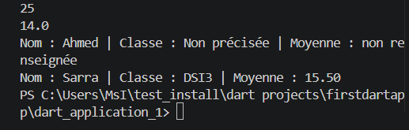
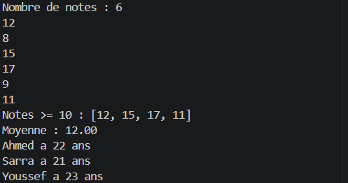
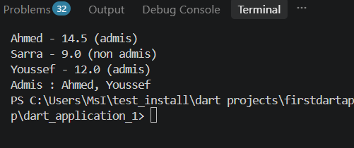
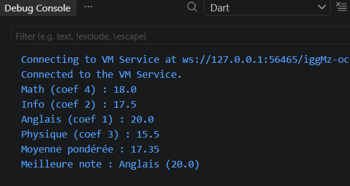

A sample command-line application with an entrypoint in `bin/`, library code
in `lib/`, and example unit test in `test/`.
## Palier 1 — Sortie attendue :

## Palier 2 — Sortie attendue :

## Palier 3 — Sortie attendue :

## Palier 4 — Sortie attendue :

## Palier 5 — Sortie attendue :

## Exercice de synthèse — Sortie attendue :
